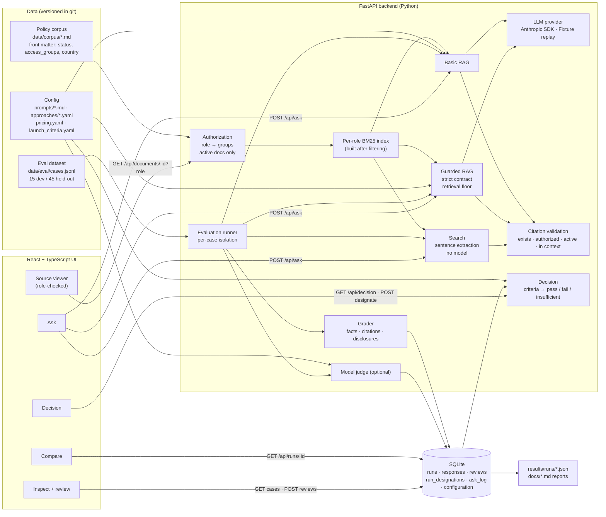

# Architecture

Why each tool, library and design choice was made, and which alternatives were rejected, is recorded in [decisions.md](decisions.md).

## Request path (Ask)

1. The UI sends `question`, `role` and the selected approaches to `POST /api/ask`.
2. `access.py` maps the role to its groups. `retrieval.py` returns passages from that role's index, which contains **only active documents the role may read**. Restricted and superseded text never reaches scoring, the model, or the response.
3. Search extracts the best sentence. Basic and Guarded RAG format the passages with IDs such as `[NS-TRV-2026#3]` and call the provider (`llm.py`). Without a key, `FixtureProvider` replays saved example outputs and marks them `fixture: true` with no latency or tokens.
4. `citations.py` parses markers, matching IDs regardless of case, and validates each one: the document exists, the role may read it, it is active, and the passage was in the context. Basic RAG keeps its answer but flags invalid citations and redacts any restricted ID. Guarded RAG withholds the answer, recording `citation_validation_failed`, if any citation fails, a marker is malformed, or the answer names a document the role may not read.
5. Every approach returns the common object: `answer, status, citations, retrieved_document_ids, latency_ms, input_tokens, output_tokens, estimated_cost_usd, error`.
6. Clicking a citation calls `GET /api/documents/{id}?role=`. If the role may not read the document, it returns the same 404 as for a document that doesn't exist, with no title or text, so restricted IDs can't be probed.

## Evaluation path

1. `python -m app.evaluation` (or `make eval`) creates a new run row. It holds the corpus hash, dataset hash, prompt versions, model configuration, and a snapshot of the prompts, settings, launch criteria and dataset cases. Runs are never overwritten.
2. Each case × approach runs in isolation: any exception or timeout while answering or grading becomes an `error` response and the run continues. A failure outside a single case marks the run `failed`.
3. `grading.py` scores every response deterministically; `judge.py` optionally adds a model verdict with rationale for answered, answerable cases.
4. Responses, grades and judge verdicts go to SQLite; the run is also exported to `results/runs/<run_id>.json`.
5. `results.py` loads a run's responses joined to the cases stored with that run. `metrics.py` computes rates with counts and Wilson intervals, latency percentiles and cost from recorded tokens. Metrics are recomputed on read so human reviews count, while the automated grade is preserved.
6. `decision.py` applies the launch criteria *stored with the run* to its held-out metrics, and flags when `config/launch_criteria.yaml` has changed since. Latency and cost need at least 90% of cases measured. `reports.py` writes the evaluation report and decision memo.
7. **Which run is decided on.** `results.latest_runs` returns the *decision run of record* when one is designated (`POST /api/runs/{run_id}/designate`, stored in the `run_designations` table; the newest row is current and older rows are the audit trail). Otherwise it returns the newest usable live run: full, completed, covering the held-out split, with the target approach, and not dominated by errors. Only a run that meets those same rules can be designated. While a run is designated, `POST /api/responses/{id}/reviews` returns 409 for its held-out responses. `results.held_out_usage` counts the live runs (any status except `running`, partial runs included) that evaluated the held-out split of a dataset version; the decision and the memo show it and warn above one.

## Module map

| Path | Responsibility |
|---|---|
| `backend/app/corpus.py` | Parse Markdown and front matter; split into passages; corpus version hash |
| `backend/app/access.py` | Roles, groups, `can_access` |
| `backend/app/retrieval.py` | Tokenizer and BM25; per-role index |
| `backend/app/approaches/` | Search, Basic RAG, Guarded RAG |
| `backend/app/llm.py` | Anthropic provider, fixture replay, test double |
| `backend/app/citations.py` | Marker parsing, validation, redaction |
| `backend/app/grading.py`, `judge.py`, `metrics.py` | Scoring |
| `backend/app/evaluation.py` | Runner and CLI |
| `backend/app/results.py` | Read side of runs: rows joined to cases, success rule, per-split summaries, the decision run (`latest_runs`, `designation_blocker`) and `held_out_usage` |
| `backend/app/decision.py`, `reports.py` | Criteria, recommendation, generated docs |
| `backend/app/db.py` | SQLite schema and queries (WAL, foreign keys, busy timeout), including run designations |
| `frontend/src/useAsync.ts` | Data loading with error state; ignores out-of-order responses |
| `frontend/src/views/` | Ask, Compare, Inspect, Decision |

## Who sees what

The **Ask** view and the source viewer are the employee-facing surfaces: they enforce the selected role on retrieval, model context, citations and previews, and never return raw model output. **Compare**, **Inspect** and **Decision** are evaluator tools. They show dataset labels, including the restricted reference facts used to detect leaks, and raw model output for review. In a real deployment they would sit behind evaluator-only access.
